# 📱 TP1 — Setup Mobexler : Environnement d'analyse Android

> **Objectif :** Mettre en place un environnement complet d'analyse d'applications Android
> en utilisant la VM Mobexler, configurer le réseau, et connecter un device Android via ADB.

---

## Étape 1 — Téléchargement de l'OVA

Téléchargement de l'image Mobexler depuis le lien officiel Google Drive.

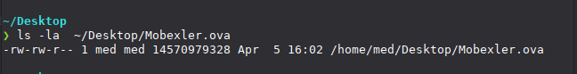

> Le fichier `.ova` est une image de machine virtuelle complète contenant
> l'environnement Mobexler préconfigurée pour l'analyse Android.

---

## Étape 2 — Vérification de l'intégrité

Vérification du hash SHA256 du fichier téléchargé pour s'assurer de son intégrité.

```bash
sha256sum Mobexler.ova
```

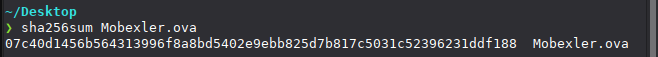

> Cette étape garantit que le fichier n'est pas corrompu et correspond
> bien à l'image officielle.

---

## Étape 3 — Import dans VirtualBox et configuration réseau

Import de l'OVA via **File → Import Appliance**, puis configuration des deux adaptateurs réseau.

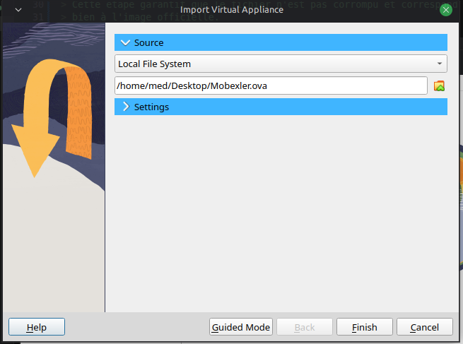
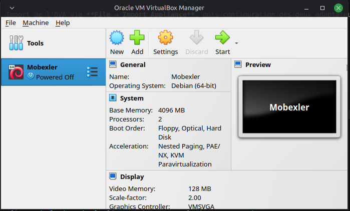


Configuration réseau après import (**VM → Settings → Network**) :

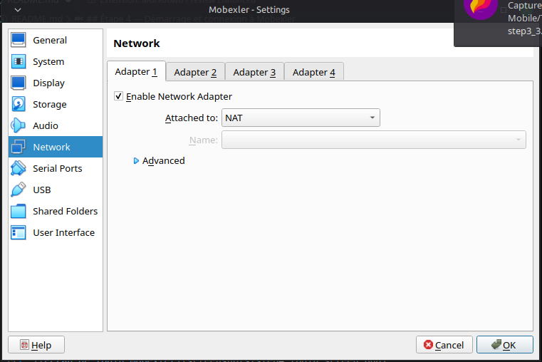

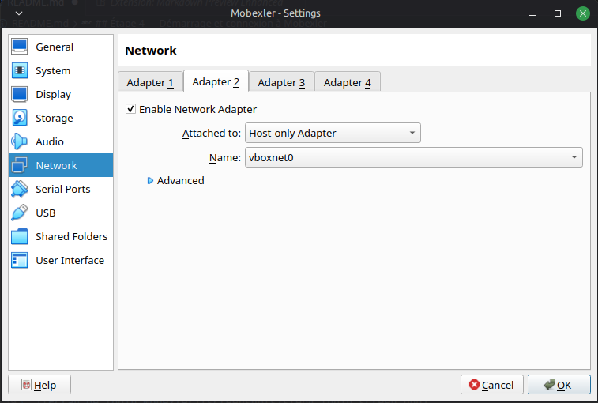

> - **NAT** : permet à la VM d'accéder à Internet pour les mises à jour et outils.
> - **Host-Only** : crée un réseau isolé entre la machine hôte et la VM,
>   nécessaire pour communiquer avec la cible Android.

---

## Étape 4 — Démarrage et connexion à Mobexler

Démarrage de la VM et connexion avec les identifiants par défaut.

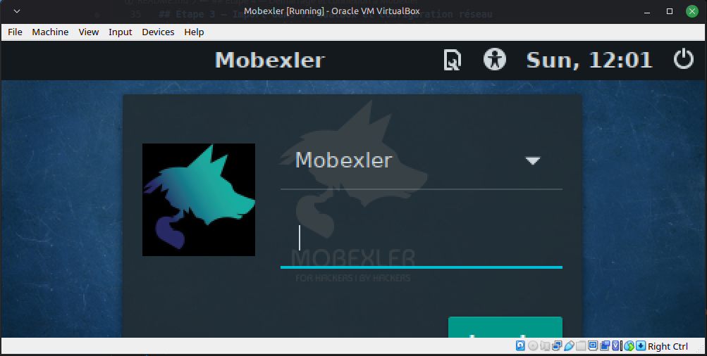

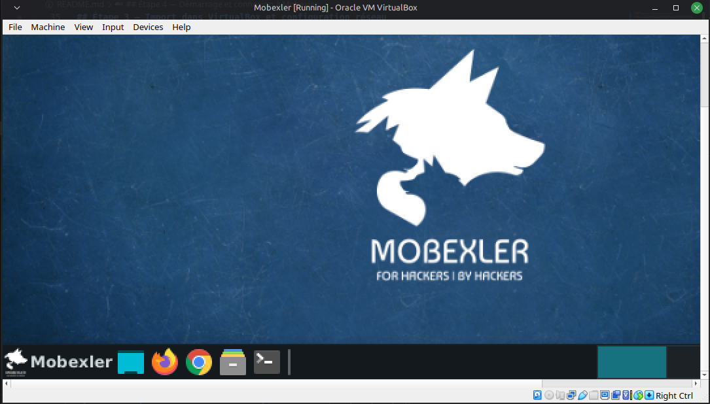

> Identifiants utilisés : `mobexler / mobexler`.
> L'accès au bureau confirme que la VM est opérationnelle.

---

## Étape 5 — Vérification de la connectivité réseau

Depuis un terminal Mobexler, vérification des interfaces, de la route par défaut et de l'accès Internet.

```bash
ip a
ip route
ping -c 2 8.8.8.8
ping -c 2 google.com
```

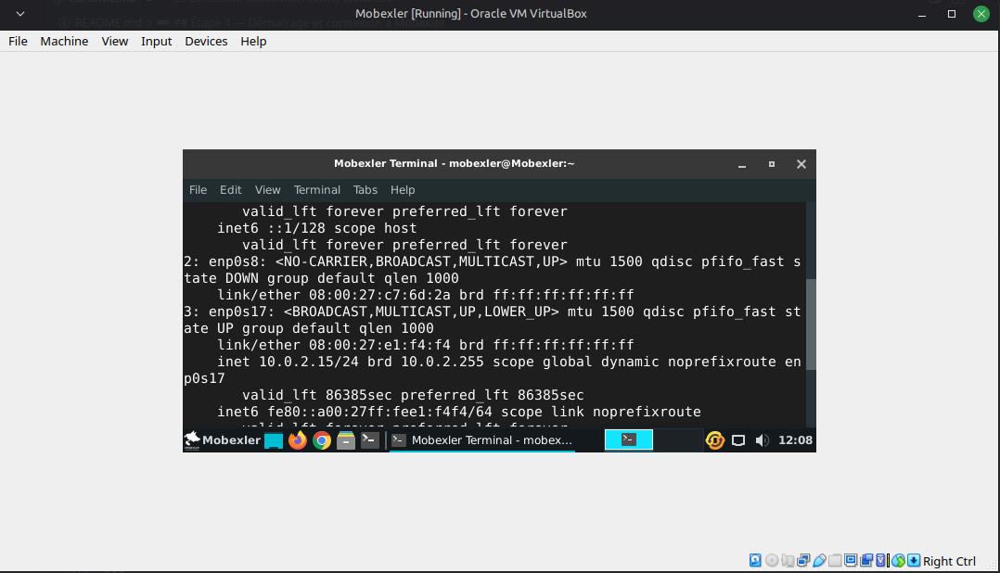

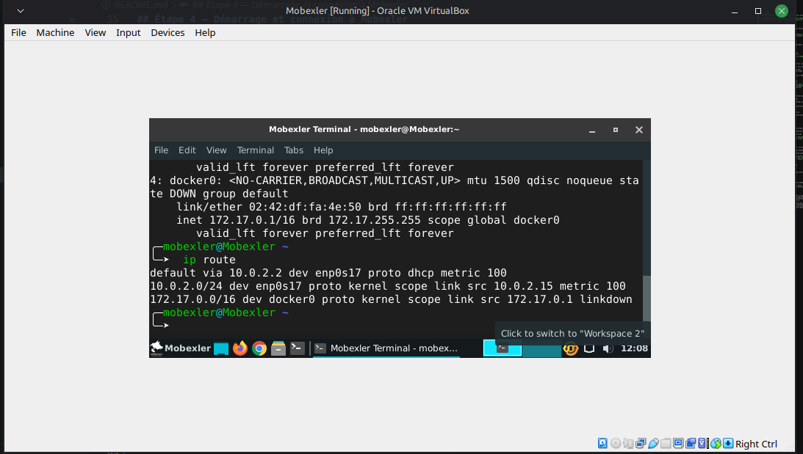

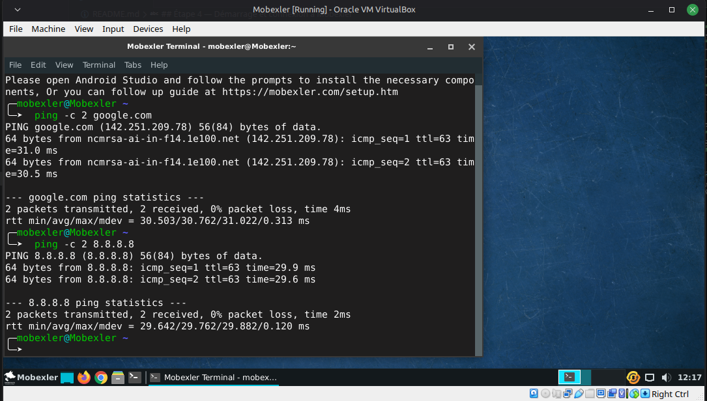

> Les deux interfaces sont bien présentes (NAT + Host-Only) et Internet
> est accessible, ce qui valide la configuration réseau complète.

---


## Étape 6 — Connexion du device Android via ADB


### Option B — Émulateur MobSF 

Connexion ADB à un device MobSF via le réseau Host-Only.

```bash
adb connect <IP_DEVICE>:5555
adb devices
```

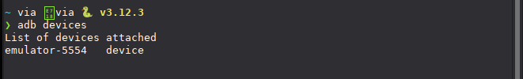

> Le device apparaît dans `adb devices` avec le statut `device`,
> ce qui confirme que le canal ADB est établi et opérationnel.

---

## Conclusion

Ce TP a permis de mettre en place un environnement d'analyse Android fonctionnel
de bout en bout. La VM Mobexler est correctement importée et configurée avec
une double carte réseau (NAT pour Internet, Host-Only pour le labo), le système
démarre normalement et la connectivité est vérifiée.

La création du snapshot `CLEAN_BASELINE_TP1` assure une base de travail
reproductible pour les prochains TPs. Enfin, la connexion ADB — que ce soit
via un smartphone physique ou un émulateur — ouvre la voie aux analyses
dynamiques d'applications Android qui seront menées dans les TPs suivants.
```

---
